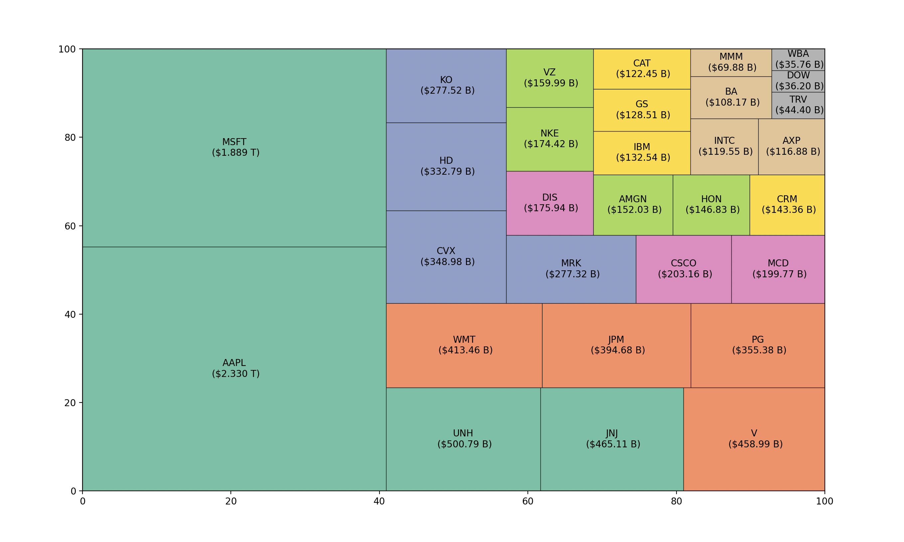

<div align="center">

# Stock Market Map in Python

</div> 




## Libraries

```
pip install beautifulsoup4
```

```
pip install requests
```

```
pip install matplotlib
```

```
pip install squarify
```

## or

```
pip install -r requirements.txt
```

py-3.10.8
