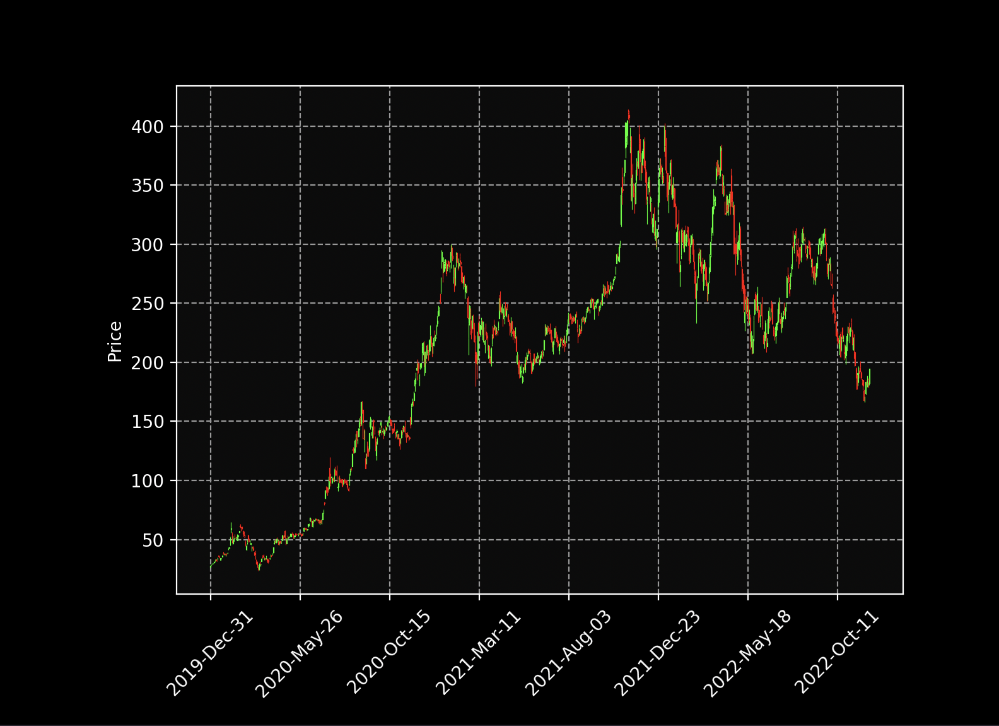
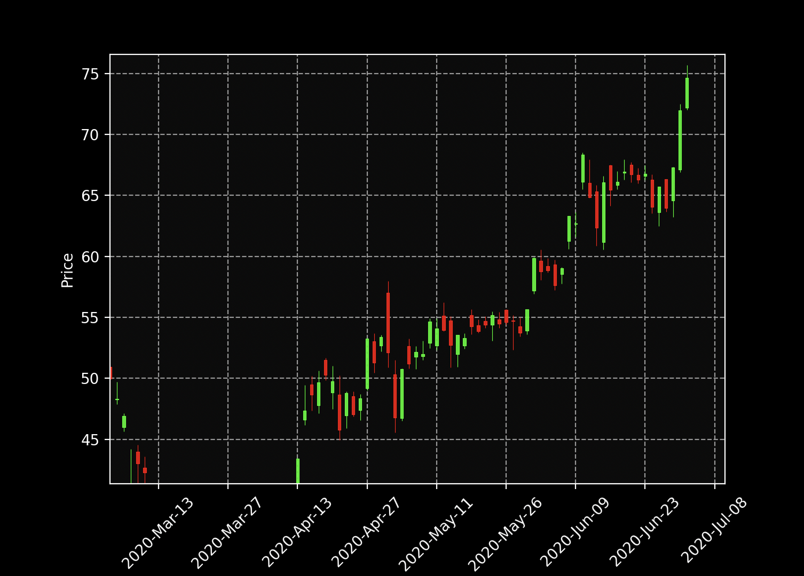

<div align="center">

# Japanese Candlestick Charts in Python

</div> 





## Libraries

```
pip install pandas
```

```
pip install pandas-datareader
```

```
pip install matplotlib
```

```
pip install mplfinance
```

## or

```
pip install -r requirements.txt
```

py-3.10.8
